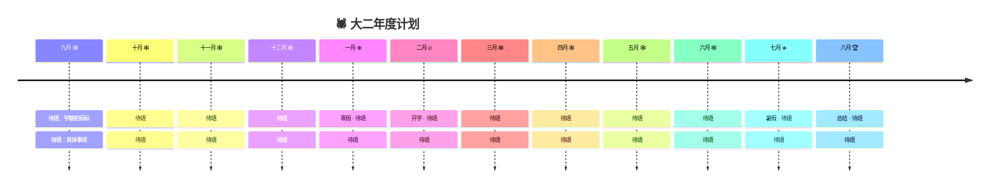

<p align="center">
  
</p>

<div align="center">
  
  <br />

  <pre style="background: transparent; border: none;">
▄︻デ🕷️══━一  💥
  </pre>

  <a href="https://github.com/Waitttforme"></a>
  <a href="mailto:your@email.com"></a>
  <br />
  
  
</div>

---

<div align="center">
  
</div>

## `> 🕷️ 身世档案`

```yaml
代号: 待填：你的名字
据点: 待填：你的学校 · 待填：你的专业
年级: 大二
觉醒方向: 待填：你的就业方向
当前技能树: [待填, 待填, 待填]
待解锁技能: [待填, 待填, 待填]
目标副本: [待填：竞赛1, 待填：竞赛2, 待填：竞赛3]
年度任务: 待填：大二结束你想成为什么样的自己
```

> *"With great power comes great responsibility."*

大二这一年，我不当路人甲。我要从零开始，把 **待填：你想深耕的方向** 一点点啃下来，到大二结束时能独立做出 **待填：你想做的项目类型**。

<div align="center">
  
</div>

## `> 🕸️ 大二行动计划`

<p align="center">
  <kbd style="background-color:#E23636;color:#fff;">上学期 · 打地基</kbd>
  <kbd style="background-color:#1C3F94;color:#fff;">寒假 · 集中突破</kbd>
  <kbd style="background-color:#E23636;color:#fff;">下学期 · 实战输出</kbd>
  <kbd style="background-color:#1C3F94;color:#fff;">暑假 · 沉淀进化</kbd>
</p>

### 🕸️ 上学期 · 打好基础

- [ ] 待填：课程 / 技能 / 目标 1
- [ ] 待填：课程 / 技能 / 目标 2
- [ ] 待填：课程 / 技能 / 目标 3
- [ ] 待填：项目 / 实践 / 目标 4
- [ ] 待填：竞赛 / 证书 / 目标 5

### 🕸️ 寒假 · 集中突破

- [ ] 待填：寒假想集中做的事 1
- [ ] 待填：寒假想集中做的事 2

### 🕸️ 下学期 · 实战输出

- [ ] 待填：课程 / 技能 / 目标 1
- [ ] 待填：课程 / 技能 / 目标 2
- [ ] 待填：项目 / 实践 / 目标 3
- [ ] 待填：竞赛 / 比赛 / 目标 4

### 🕸️ 暑假 · 查漏补缺 / 实习 / 进一步

- [ ] 待填：暑假计划 1
- [ ] 待填：暑假计划 2
- [ ] 待填：暑假计划 3

<div align="center">
  
</div>

## `> 🕷️ 年度时间线`



<div align="center">
  
</div>

## `> 🕸️ 能力蛛网`

<div align="center">
  <h3>🎯 编程语言</h3>
  
  <h3>⚙️ 工具与系统</h3>
  
  <h3>🔧 硬件与嵌入式</h3>
  
  
  
  
  
  <h3>🔮 视野拓展</h3>
  
  
</div>

<br />

| 🕸️ 能力维度 | 🎯 我想学到什么 | ✅ 如何验证 |
|---|---|---|
| 基础知识 | 待填 | 待填 |
| 动手实践 | 待填 | 待填 |
| 项目经验 | 待填 | 待填 |
| 工程习惯 | 待填 | 待填 |

<div align="center">
  
</div>

## `> 🕷️ 任务副本`

<table>
  <tr>
    <td width="50%" valign="top">
      <p align="center"></p>
      <h3 align="center">🕸️ 待填：项目名</h3>
      <p align="center">
        
      </p>
      <p align="center">待填：技术栈</p>
      <p>待填：项目描述，打算做什么</p>
      <p align="center">
        <kbd>待填</kbd> <kbd>待填</kbd> <kbd>待填</kbd>
      </p>
    </td>
    <td width="50%" valign="top">
      <p align="center"></p>
      <h3 align="center">🕸️ 待填：项目名</h3>
      <p align="center">
        
      </p>
      <p align="center">待填：技术栈</p>
      <p>待填：项目描述，打算做什么</p>
      <p align="center">
        <kbd>待填</kbd> <kbd>待填</kbd> <kbd>待填</kbd>
      </p>
    </td>
  </tr>
  <tr>
    <td width="50%" valign="top">
      <p align="center"></p>
      <h3 align="center">🕸️ 待填：项目名</h3>
      <p align="center">
        
      </p>
      <p align="center">待填：技术栈</p>
      <p>待填：项目描述，打算做什么</p>
      <p align="center">
        <kbd>待填</kbd> <kbd>待填</kbd> <kbd>待填</kbd>
      </p>
    </td>
    <td width="50%" valign="top">
      <p align="center"></p>
      <h3 align="center">🕸️ 待填：项目名</h3>
      <p align="center">
        
      </p>
      <p align="center">待填：技术栈</p>
      <p>待填：项目描述，打算做什么</p>
      <p align="center">
        <kbd>待填</kbd> <kbd>待填</kbd> <kbd>待填</kbd>
      </p>
    </td>
  </tr>
</table>

<div align="center">
  
</div>

## `> 🏆 竞赛目标`

<div align="center">
  
  
  
</div>

<div align="center">
  
</div>

## `> 📊 贡献足迹`

<div align="center">
  
  
</div>

<div align="center">
  
</div>

## `> 🐍 贡献蛇形图`

<p align="center">
  <picture>
    <source media="(prefers-color-scheme: dark)" srcset="https://raw.githubusercontent.com/Waitttforme/Waitttforme/output/github-snake-dark.svg" />
    <source media="(prefers-color-scheme: light)" srcset="https://raw.githubusercontent.com/Waitttforme/Waitttforme/output/github-snake.svg" />
    
  </picture>
</p>

<div align="center">
  
</div>

<details>
  <summary><strong>🕷️ 我为什么要做这个页面</strong></summary>
  <br />
  <p align="center">
    
  </p>
  <p>
    大二这一年，我不做旁观者。每一门课、每一个项目、每一次比赛，都是织网的一根丝。这个页面是我给自己立的 flag，每次打开 GitHub，都提醒自己今年要成为什么样的人。
  </p>
  <p>
    如果你也在这条路上，欢迎一起组队打怪升级。学长学姐路过的话，求指导求带飞 🙏
  </p>
</details>

<p align="center">
  <a href="mailto:your@email.com"></a>
</p>

<p align="center">
  
</p>
