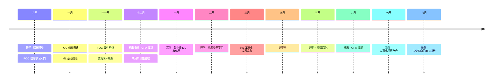


<div align="center">

<br />

## 待填 · 你的名字

*待填 · 你的学校 · 你的专业*

<br />

<br />

</div>

---

<br />

### 关于我

```yaml
name:     待填
school:   待填 · 待填
year:     大二
focus:   FOC / 机器学习 / SW / 仿真 / GPA / 电源
```

大二这一年，不撒网，只挖六口井。把每一件事做到自己能交代的程度。

<br />

### 这一年

**FOC 电机控制**

- [ ] 理解 FOC 基本原理：Clark / Park 变换、SVPWM、电流环速度环
- [ ] 在 STM32 或 DSP 上跑通一套 FOC 方案
- [ ] 完成一个带编码器反馈的电机控制闭环项目

**机器学习**

- [ ] 掌握基础：线性回归、逻辑回归、SVM、决策树、神经网络
- [ ] 用 Python / PyTorch 完成至少两个完整项目
- [ ] 尝试将 ML 与控制结合，探索数据驱动的参数整定

**SW 软件与嵌入式软件**

- [ ] 熟练 C / C++ 在嵌入式场景下的工程实践
- [ ] 掌握 FreeRTOS 任务调度、IPC、中断管理
- [ ] 形成自己的驱动库和代码模板，减少重复造轮子

**仿真**

- [ ] 学会使用 MATLAB / Simulink 进行控制系统建模仿真
- [ ] 能用 MuJoCo 或 Gazebo 搭建简单的机器人仿真环境
- [ ] 做到仿真结果与实际测试形成闭环验证

**GPA**

- [ ] 保持专业课程均分 3.5 以上
- [ ] 不让课外项目成为挂科的借口
- [ ] 数学（线代、概率论）和信号与系统重点拿分

**电源**

- [ ] 理解 Buck / Boost 拓扑和基本选型
- [ ] 掌握供电完整性：压降、纹波、负载瞬态
- [ ] 在项目中将电源作为一等公民，而不是最后加根线

<br />

### 时间线



<br />

### 技能

`C` `C++` `Python` `MATLAB` `FreeRTOS` `FOC` `PyTorch` `Simulink` `Linux` `Git`

<br />

### 项目

| 项目 | 说明 | 状态 |
| --- | --- | --- |
| FOC 电机控制闭环 | 从仿真到硬件，跑通电流环/速度环 | ○ |
| ML 数据驱动控制 | 用机器学习做参数整定或系统辨识 | ○ |
| 机器人仿真环境 | MuJoCo 或 Gazebo 建模与验证 | ○ |
| 电源完整性实践 | 选型、压降、纹波、负载瞬态实测 | ○ |

<br />

### 竞赛

| 比赛 | 目标 |
| --- | --- |
| 电赛 | 待填 |
| 嵌赛 | 待填 |
| 工创物流小车 | 待填 |
| 省综合 | 待填 |
| 西门子 | 待填 |
| 数模 | 待填 |
| 数竞 | 待填 |

<br />

### 足迹

<div align="center">


</div>

<br />

<div align="center">
  <sub>待填 · your@email.com</sub>
</div>

<br />
