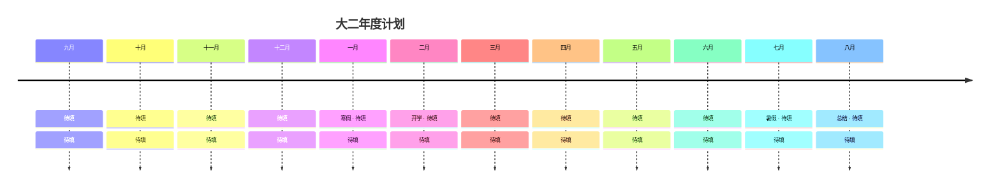

<p align="center">
  
</p>

<div align="center">
  <a href="https://git.io/typing-svg">
    
  </a>
  <br />
  <a href="https://github.com/Waitttforme"></a>
  <a href="mailto:your@email.com"></a>
  <br />
  
  
</div>

---

## 个人定位

```yaml
name: 待填
school: 待填 · 待填
year: 大二
direction: 待填
learning: [待填, 待填, 待填]
targets: [待填, 待填, 待填]
goal: 待填
```

大二这一年，我想把时间真正用在 **待填** 上，扎扎实实地打好基础，到大二结束能独立完成 **待填**。

---

## 大二学习计划

### 上学期 · 打好基础

- [ ] 待填
- [ ] 待填
- [ ] 待填
- [ ] 待填
- [ ] 待填

### 寒假 · 集中突破

- [ ] 待填
- [ ] 待填

### 下学期 · 实战输出

- [ ] 待填
- [ ] 待填
- [ ] 待填
- [ ] 待填

### 暑假 · 沉淀提升

- [ ] 待填
- [ ] 待填
- [ ] 待填

---

## 时间线



---

## 技能目标

<div align="center">
  <h3>编程语言</h3>
  
  <h3>工具与系统</h3>
  
  <h3>硬件与嵌入式</h3>
  
  
  
  
  <h3>拓展</h3>
  
  
</div>

| 维度 | 我想学到什么 | 如何验证 |
|---|---|---|
| 基础 | 待填 | 待填 |
| 实践 | 待填 | 待填 |
| 项目 | 待填 | 待填 |
| 习惯 | 待填 | 待填 |

---

## 想做的项目

<table>
  <tr>
    <td width="50%" valign="top">
      <h3 align="center">待填</h3>
      <p align="center">
        
      </p>
      <p align="center">待填：技术栈</p>
      <p>待填：项目描述</p>
    </td>
    <td width="50%" valign="top">
      <h3 align="center">待填</h3>
      <p align="center">
        
      </p>
      <p align="center">待填：技术栈</p>
      <p>待填：项目描述</p>
    </td>
  </tr>
  <tr>
    <td width="50%" valign="top">
      <h3 align="center">待填</h3>
      <p align="center">
        
      </p>
      <p align="center">待填：技术栈</p>
      <p>待填：项目描述</p>
    </td>
    <td width="50%" valign="top">
      <h3 align="center">待填</h3>
      <p align="center">
        
      </p>
      <p align="center">待填：技术栈</p>
      <p>待填：项目描述</p>
    </td>
  </tr>
</table>

---

## 竞赛目标

<div align="center">
  
  
  
</div>

---

## GitHub 足迹

<div align="center">
  
  
</div>

<div align="center">
  
</div>

---

## 贡献蛇形图

<p align="center">
  <picture>
    <source media="(prefers-color-scheme: dark)" srcset="https://raw.githubusercontent.com/Waitttforme/Waitttforme/output/github-snake-dark.svg" />
    <source media="(prefers-color-scheme: light)" srcset="https://raw.githubusercontent.com/Waitttforme/Waitttforme/output/github-snake.svg" />
    
  </picture>
</p>

---

<details>
  <summary><strong>关于这个页面</strong></summary>
  <br />
  <p>
    这是一份公开的大二年度计划。每次打开 GitHub，提醒自己今年想成为什么样的人。如果你也在路上，欢迎一起。
  </p>
</details>

<p align="center">
  <a href="mailto:your@email.com"></a>
</p>

<p align="center">
  
</p>
